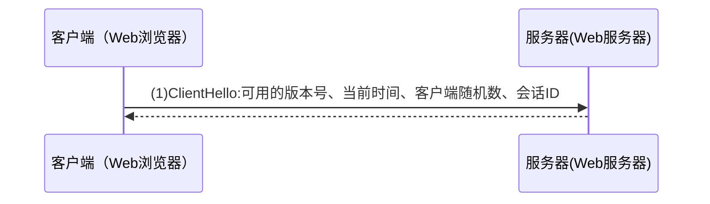


[TOC]
## 0、密码学的基础
### 概念
* 密码学(cryptography)：目的是通过将信息编码使其不可读，从而达到安全性。
* 明文(plain text)：发送人、接受人和任何访问消息的人都能理解的消息。
* 密文(cipher text)：明文消息经过某种编码后，得到密文消息。
* 加密(encryption)：将明文消息变成密文消息。
* 解密(decryption)：将密文消息变成明文消息。
* 算法：取一个输入文本，产生一个输出文本。
* 加密算法：发送方进行加密的算法。
* 解密算法：接收方进行解密的算法。
* 密钥(key)：只有发送方和接收方理解的消息。
* 对称密钥加密(Symmetric Key Cryptography)：加密与解密使用相同密钥。
* 非对称密钥加密(Asymmetric Key Cryptography)：加密与解密使用不同密钥。


### 密码学的六种重要工具
* 对称密码          &nbsp;&nbsp;&nbsp;——用相同的密钥进行加解密
* 公钥密码           ——用公钥加密，用私钥解密
* 单向散列函数      ——获取消息的“指纹”
* 消息认证码        ——消息是否正确传输
* 数字签名           ——消息是谁发送的
* 伪随机数生成      ——不可预测的源泉


| **名称** |**解析**  |**作用**|**实现方法**|**存在的问题**|
| --- | --- | --- |---|---|
| **对称密码** （基础工具）| 用相同的密钥进行加解密 |||
| **公钥密码** （基础工具）| 用公钥加密，用私钥解密 ||
| **单向散列函数**（基础工具） |获取消息的“指纹”  ||
| **消息认证码** |消息是否正确传输（收发端需要共享密钥）  |防伪装，防篡改|单向散列+对称密钥|第三方认证、防止否认|
| **数字签名** | 消息是谁发送的 |防伪装，防篡改、否认|单向散列+非对称加密|公钥必须是否是真正的发送者|||
| **伪随机数生成**（基础工具） | 不可预测的源泉 ||


**密钥分类**：
用途分
* 用于确保机密性的密钥：对称密钥和公钥
* 用于认证的密钥：消息认证码和数字签名所使用的密钥

使用次数：
* 会话密钥
* 主密钥

加密的对象：
* CEK：加密内容的密钥，Contents Encrypting Key ，一般为Session Key
* KEK：加密密钥的密钥，Key Encrypting Key，        一般为Master Key

密钥交换算法：Diffie–Hellman key exchange
* 有限域（finite field）的离散对数问题，
* 生成元
附录：《图解密码技术》，P268

## 1、加密，解密
### 1.1 [对称加解密](https://www.cnblogs.com/labimeilexin/p/7350448.html)

* **对称加密采用了对称密码编码技术，它的特点是文件加密和解密使用相同的密钥加密**
* * *
* 也就是密钥也可以用作解密密钥，这种方法在密码学中叫做对称加密算法，对称加密算法使用起来简单快捷，密钥较短，且破译困难，除了数据加密标准（DES），另一个对称密钥加密系统是国际数据加密算法（IDEA），它比DES的加密性好，而且对计算机功能要求也没有那么高。
* 对称加密算法在电子商务交易过程中存在几个问题：
>1、要求提供一条安全的渠道使通讯双方在首次通讯时协商一个共同的密钥。直接的面对面协商可能是不现实而且难于实施的，所以双方可能需要借助于邮件和电话等其它相对不够安全的手段来进行协商；  
2、密钥的数目难于管理。因为对于每一个合作者都需要使用不同的密钥，很难适应开放社会中大量的信息交流；
3、对称加密算法一般不能提供信息完整性的鉴别。它无法验证发送者和接受者的身份；  
4、对称密钥的管理和分发工作是一件具有潜在危险的和烦琐的过程。对称加密是基于共同保守秘密来实现的，采用对称加密技术的贸易双方必须保证采用的是相同的密钥，保证彼此密钥的交换是安全可靠的，同时还要设定防止密钥泄密和更改密钥的程序。 

* 假设两个用户需要使用对称加密方法加密然后交换数据，则用户最少需要2个密钥并交换使用，如果企业内用户有n个，则整个企业共需要n×(n-1) 个密钥，密钥的生成和分发将成为企业信息部门的恶梦。


对称加密在传统密码体制中，用于加密的密钥和解密的密钥完全相同，通过这两个密钥来共享信息。这种体制所使用的加密算法比较简单，但高效快速，密钥简短，破译困难。然而密钥的传送和保管是一个问题。例如，通讯双方要用同一个密钥加密与解密，首先，将密钥分发出去是一个难题，在不安全的网络上分发密钥显然是不合适的;另外，任何一方将密钥泄露，那么双方都要重新启用新的密钥。
常见算法：MD5、RSA、DES
问题：共享的密钥不安全、通信者都需要不通密钥、通信双方都可否认信息。

* * *


**常见的对称加密算法有DES、3DES、Blowfish、IDEA、RC4、RC5、RC6和AES** 

**Authenticated Encryption with Associated Data (AEAD)** 是一种同时具备**保密性**，**完整性**和**可认证性**的加密形式。

>1、AEAD 产生的原因很简单，单纯的对称加密算法，其解密步骤是无法确认密钥是否正确的。也就是说，加密后的数据可以用任何密钥执行解密运算，得到一组疑似原始数据，而不知道密钥是否是正确的，也不知道解密出来的原始数据是否正确；
>2、因此，需要在单纯的加密算法之上，加上一层验证手段，来确认解密步骤是否正确。
>[出处](https://zhuanlan.zhihu.com/p/28566058)
***

### 1.2 [非对称加解密]()

* 非对称加密
* 公钥加密、私钥解密
* 获取密钥方式：直接联系对方;
* 第三方可靠验证机构(如：Certification Authority，CA)


参考资料：
1、[RSA原理介绍](http://www.ruanyifeng.com/blog/2013/06/rsa_algorithm_part_one.html)
2、
## 2、[加签，验签](http://www.ruanyifeng.com/blog/2011/08/what_is_a_digital_signature.html)


## 3、[国密，商密](https://blog.csdn.net/hugengyong/article/details/81170684)

**国密和商密的比较：**
[图片来源连接](https://blog.csdn.net/yzpbright/article/details/87166957)

|  |                      **国密算法** |**国际算法**  |
| --- | --- | --- |
| **非对称算法** | SM2 | RSA  |
|  **对称算法**|  SM1| AES  |
|  **对称算法**| SM4 |DES/3DES  |
|  **哈希算法**|  SM3|SHA256  |


* 非对称加密算法，SM2性能更优更安全：密码复杂度高、处理速度快、机器性能消耗更小
* 

|  | **SM2** | **RSA** |
| --- | --- | --- |
| **算法结构** |基本椭圆曲线（ECC）  |基于特殊的可逆模幂运算  |
| **计算复杂度**|完全指数级  |亚指数级  |
| **存储空间** |192-256bit  |2048-4096bit  |
|**密钥生成速度**|  较RSA算法快百倍以上|  慢|
| **解密加密速度**| 较快 |一般  |
* 
* 哈希算法，SM3安全性高：压缩函数更复杂SM3在SHA-256基础上改进，压缩函数的每一轮都使用2个消息字，具有更高的安全性。
* 对称加密算法，SM4更安全：计算轮数多、增加非线性变化

|  |**SM4**  |**DES**  |**AES**  |
| --- | --- | --- | --- |
| **计算轮数** |32  |16（3DES为16\*3）  |10/12/14  |
| **密码部件** |S盒，非线性变换，线性变换，合成变换  |标准算术和逻辑运算、先替代后置换，不含非线性变换  |S盒,行移位变换，列混合变换,圈密钥加交换  |
* 


参考资料:
1、[国密算法概述](https://blog.csdn.net/lwzhang1101/article/details/78773700)
2、[国密算法比较](https://zhuanlan.zhihu.com/p/34618269)
3、[国密工具包](http://gmssl.org/)
4、[商密工具]()


## 4、[证书](https://www.jianshu.com/p/c65fa3af1c01)，[CFCA](http://www.cfca.com.cn/)，CA
**证书和公钥:**
**证书 = 公钥 + 数字签名**

### PKI（公钥基础设施——Public-Key Infrastructure）
是为了能够更有效地运用公钥而制定的一系列规范和规格的总称。PKI基本组成要素：
* **用户** ——使用PKI的人
* **认证机构** ——颁发证书的人
* **仓库**——保证证书的数据库

靠隐秘来保证安全是错误的
### 4.1 证书 -为公钥加上数字签名
**Certification Path from CA's Public Key (CA 1) to the Target Subject**


```shell
$ openssl x509 -in ysf.cer -noout -text
Certificate:
    Data:
        Version: 3 (0x2)
        Serial Number: 274881513107 (0x4000370693)
    Signature Algorithm: sha256WithRSAEncryption
        Issuer: C=CN, O=China Financial Certification Authority, CN=CFCA ACS TEST OCA31
        Validity
            Not Before: Apr 26 10:47:34 2017 GMT
            Not After : Apr 26 10:47:34 2022 GMT
        Subject: C=CN, O=OCA31RSA, OU=shanghaiTech, OU=Organizational-2, CN=SHTech@banktest2@8222222222222222@1
        Subject Public Key Info:
            Public Key Algorithm: rsaEncryption
                Public-Key: (2048 bit)
                Modulus:
                    00:dc:82:28:f6:36:61:5b:7e:d6:38:1a:a2:a4:b7:
                    d6:cd:d4:df:db:44:d3:00:e5:a5:6b:2e:99:80:6f:
                    c7:05:33:94:4a:c3:54:7d:79:1f:1b:ba:0e:f1:f8:
                    30:e3:6e:0e:15:d6:6b:43:77:56:08:df:9c:1a:51:
                    85:37:f5:93:92:9f:ff:e3:7d:db:d7:3e:c3:b3:34:
                    8d:5f:ce:d1:31:50:01:36:85:f7:6d:7d:7e:33:54:
                    ea:6b:24:64:60:69:61:71:60:75:1f:38:78:5b:72:
                    55:3d:88:19:0c:20:4a:a6:c5:eb:3b:70:d2:b6:aa:
                    45:fe:62:b4:3f:32:a2:32:3c:fc:ed:a3:54:1c:7a:
                    00:e0:89:17:b2:af:1a:ad:26:a8:04:8d:5a:55:0a:
                    7f:0a:c7:1d:fd:56:8b:80:00:a7:fc:fa:d7:51:0c:
                    a7:42:dd:01:89:38:52:21:75:b1:ca:a7:73:d5:19:
                    11:3e:d2:65:8b:85:72:7b:d7:f5:b7:39:f8:67:b8:
                    c2:c3:0b:14:30:2d:53:94:a0:5e:17:d4:7c:ab:15:
                    7f:7b:d7:d7:40:21:d4:78:f8:9a:24:8b:3c:f3:bf:
                    a5:bb:d6:2e:9d:7c:a6:7a:91:ef:1e:10:c7:b0:ca:
                    08:18:6b:23:cd:95:07:2f:1e:b0:c9:d5:f4:44:c0:
                    b4:75
                Exponent: 65537 (0x10001)
        X509v3 extensions:
            Authority Information Access: 
                OCSP - URI:http://210.74.42.11:8085/ocsp_server/ocsp/

            X509v3 Authority Key Identifier: 
                keyid:9A:3D:B4:AE:65:58:FB:CE:5A:05:78:26:A0:6D:2B:04:86:BA:C6:EC

            X509v3 Basic Constraints: critical
                CA:FALSE
            X509v3 CRL Distribution Points: 

                Full Name:
                  URI:http://210.74.42.3/OCA31/RSA/crl669.crl

            X509v3 Key Usage: critical
                Digital Signature, Non Repudiation, Key Agreement
            X509v3 Subject Key Identifier: 
                AF:56:8C:D5:13:F9:22:A3:E5:94:E8:B7:B6:1F:3A:00:64:B1:AA:C8
            X509v3 Extended Key Usage: 
                TLS Web Client Authentication, E-mail Protection
    Signature Algorithm: sha256WithRSAEncryption
         21:d1:6d:d3:16:c0:05:9e:ae:83:c9:07:3e:ed:fb:4d:13:28:
         a8:d8:06:ad:bd:4d:04:fe:f8:d2:2f:dc:b9:fd:ed:fa:e5:46:
         bd:ab:86:98:ca:9a:13:bb:8c:fd:2c:50:10:7c:0a:4a:4e:cf:
         86:6f:f8:8d:e3:3b:18:65:5b:85:ee:cc:81:53:eb:92:98:cc:
         e2:b3:50:e7:43:04:77:ff:4d:dd:c4:65:35:eb:b5:a5:b7:c8:
         1c:31:31:e1:b4:55:e2:03:e5:19:19:6d:38:6a:13:0f:db:dd:
         e3:ea:1d:70:cc:f4:f9:a5:27:e4:6b:50:cf:aa:84:eb:9f:70:
         11:db:0b:25:37:68:4f:70:44:49:e8:3a:47:3d:5d:85:25:bb:
         96:b4:b4:57:8c:96:cf:e6:2f:ad:56:77:d8:87:bb:02:b5:00:
         dd:36:19:3d:39:9e:b6:27:8f:c8:25:f0:62:c6:8c:94:cf:f5:
         25:8f:47:7e:89:fc:97:bc:e8:ec:40:b5:dd:d9:20:b0:de:57:
         0b:65:61:75:7f:a0:f9:eb:7c:56:65:a0:41:a4:7a:a1:bb:e3:
         3c:9d:78:e8:98:66:6b:94:dd:5d:20:cf:99:a0:fa:d6:80:31:
         49:7d:24:c6:29:f2:e5:9c:00:4e:1d:2e:0e:0a:7b:95:7b:51:
         96:06:d7:d6
```

### 4.2 根CA信任模型

根 CA 信任模型，也称作严格层次信任模型。该信任模型下，CA 中心可以分为多级，用户证书由CA中心签发，各级CA中心之间呈现严格的层次关系，最上级CA中心只有一个，称作根CA，其他CA称作子CA。根CA的数字证书由自己签发，属于自签名证书，子CA的数字证书由上级CA签发。信任锚可以是根CA，也可以是子CA。

根 CA 信任模型，也称作严格层次信任模型。该信任模型下，CA 中心可以分为多级，用户证书由CA中心签发，各级CA中心之间呈现严格的层次关系，最上级CA中心只有一个，称作根CA，其他CA称作子CA。根CA的数字证书由自己签发，属于自签名证书，子CA的数字证书由上级CA签发。信任锚可以是根CA，也可以是子CA。如图2-5所示，根CA签发子CA1证书和子CA2证书，子CA2签发子CA3证书和子CA4证书，子CA1签发用户A证书，子CA3签发用户B证书和用户C证书，子CA4签发用户D证书。用户X的信任锚为根CA，因此它可信任子CA1，从而信任用户A证书。于是，从用户X的角度，用户A证书的**信任链**为：**根CA➔子CA1➔用户A证书**。用户Y的信任锚为子CA2，因此它可信任子CA4，从而信任用户D证书。于是，从用户Y的角度，用户D证书的信任链为：**子CA2➔子CA4➔用户D证书**。


参考资料：
* [PKI/CA工作原理及架构](https://www.jianshu.com/p/c65fa3af1c01)
* [PKI/CA与数字证书技术大全](https://book.douban.com/subject/27078242/)
* [PKI/CA与数字证书](https://blog.csdn.net/u013066292/article/details/79538069)
* [加密体系介绍（LMK、ZMK、ZAK、ZPK）](https://blog.csdn.net/wenbin9420/article/details/87932585)
* [5分钟让你知道什么是PKI](https://zhuanlan.zhihu.com/p/30136885)
* [公钥基础设施和密码学中的私钥的角色](https://zhuanlan.zhihu.com/p/45457978)


### 4.3 CFCA，中国金融认证中心
* 两码:序列号和授权码来下载证书
* 介绍：中国金融认证中心（China Financial Certification Authority，简称CFCA）是经中国人民银行和国家信息安全管理机构批准成立的国家级权威安全认证机构，是国家重要的金融信息安全基础设施之一。

### 4.4 证书格式
[证书格式](https://www.zhihu.com/question/29620953)


* [ ] [PKCS 全称是 Public-Key Cryptography Standards ，是由 RSA 实验室与其它安全系统开发商为促进公钥密码的发展而制订的一系列标准，PKCS 目前共发布过 15 个标准。 常用的有](https://www.zhihu.com/question/29620953/answer/191763719)：
>* PKCS#7 Cryptographic Message Syntax Standard
>* PKCS#10 Certification Request Standard
>* PKCS#12 Personal Information Exchange Syntax Standard
>* X.509是常见通用的证书格式。所有的证书都符合为Public Key Infrastructure (PKI) 制定的 ITU-T X509 国际标准。
>* PKCS#7 常用的后缀是： .P7B .P7C .SPC
>* PKCS#12 常用的后缀有： .P12 .PFX
>* X.509 DER 编码(ASCII)的后缀是： .DER .CER .CRT
>* X.509 PAM 编码(Base64)的后缀是： .PEM .CER .CRT
>* .cer/.crt是用于存放证书，它是2进制形式存放的，不含私钥。
>* .pem跟crt/cer的区别是它以Ascii来表示。
>* pfx/p12用于存放个人证书/私钥，他通常包含保护密码，2进制方式
>* p10是证书请求
>* p7r是CA对证书请求的回复，只用于导入
>* p7b以树状展示证书链(certificate chain)，同时也支持单个证书，不含私钥。


## 5、TLS协议
### 密码套件（cipher suite）
* 对称密码
* 消息认证码
* 公钥密码
* 数字签名
* 伪随机数生成器

### TLS协议层次化结构

* TLS由两部分组成：TLS记录协议（TLS record protocol）和TLS握手协议（TLS handshake protocol）这两层协议叠加而成。
#### TLS记录层协议
**位于底层，负责进行加密**
>使用了**对称密码**和**消息认证码**
>具体的**算法**和**共享密钥**通过握手协议在服务器和客户端之间协商决定的

* 首先 分割消息，将消息分割为多个较短的片段（fragment）
* 片段压缩
* 压缩结果计算MAC，计算MAC的共享密钥都需与通信对象协商决定
* 对压缩和MAC进行加密，加密为CBC模式，初始化向量（IV）通过主密码（master secret）生成，**对称密码的算法**以及**共享密钥**需要与通信对象协商决定
* CBC：密码分组链接（Cipher-block chaining），每个明文块先与前一个密文块进行异或后，再进行加密。每个密文块都依赖于他前面的所有明文块。第一块需要初始化向量。
* 增加header信息封装成报文，header 信息包括：类型，版本，长度
* 
#### TLS握手协议
**位于上层的TLS握手协议则负责除加密以外的其他各种操作**

握手协议包含以下四个部分：
>1. TLS握手协议
>负责生成共享密钥以及交换证书
>



>2. 密码规格变更协议
>
>3. 警告协议
>4. 应用数据协议


### 当代

参考文献：
1、[TLS协议设计 ](https://blog.helong.info/blog/2015/09/07/tls-protocol-analysis-and-crypto-protocol-design/)
2、[TLS协议分析合集](https://mp.weixin.qq.com/s/OgSIsPIzsCj_s8scKMSrkw)
## 6、明文传输方式
### [MAC](https://baike.baidu.com/item/MAC/329741)
**消息被正确传输了吗**


### 签名
**消息到底是谁写的**

## 7、[在线工具](https://www.sojson.com/encrypt.html)
## 8、扩展PGP
 * [PKI与PGP(GPG)](https://zhuanlan.zhihu.com/p/37059490)
 * [公钥真是公开的吗？](https://zhuanlan.zhihu.com/p/34715394)

## 9、问题思考
* [为什么需要两套密钥](https://zhidao.baidu.com/question/117338621.html)（签名和加密）
* 

